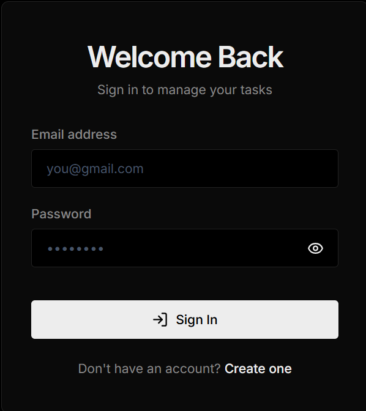
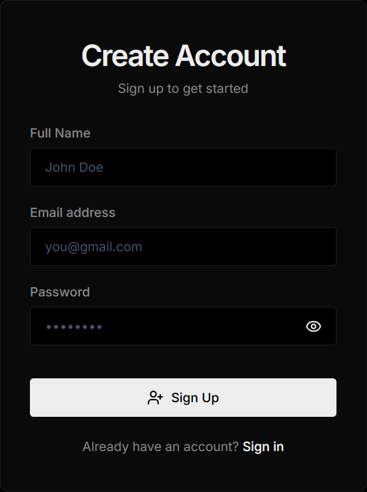
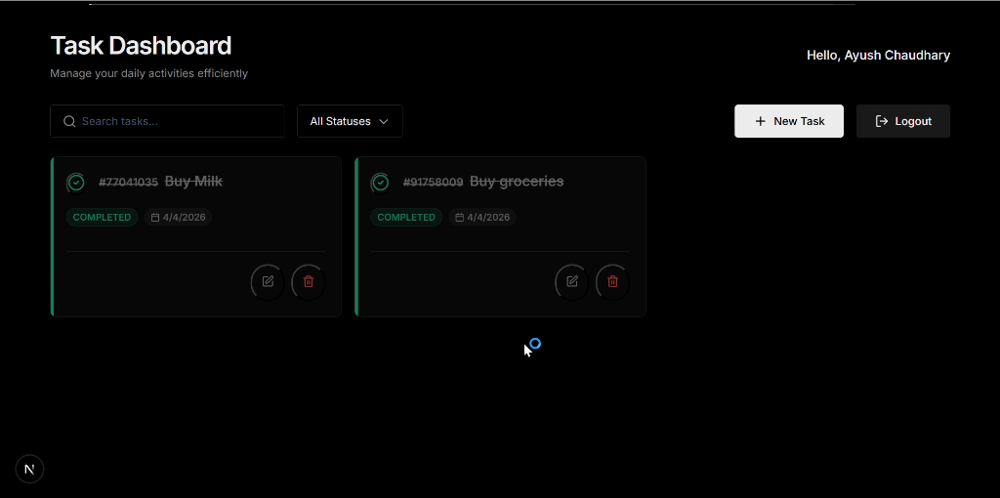
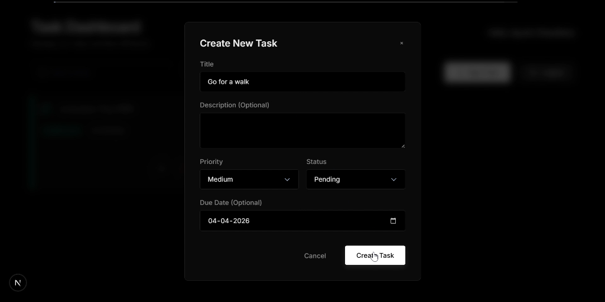
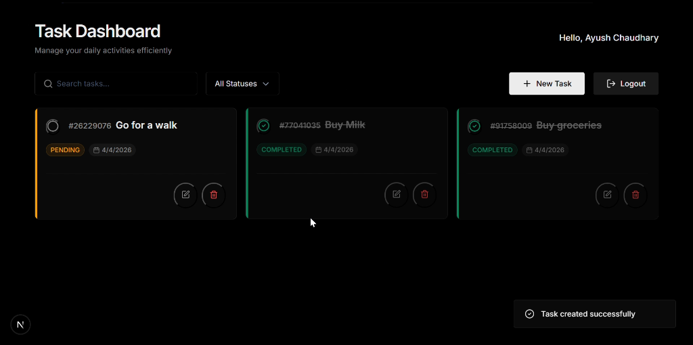

# Task Management System (TMS)

A production-ready, ultra-minimalist Task Management System built with a high-performance **Next.js** frontend and a robust **Node.js/Express** backend.

## 🚀 Features

### 👤 Authentication & Security
- **Real-time Validation**: Interactive Gmail format enforcement (`@gmail.com`) during registration and login.
- **JWT Protection**: Secure authentication using Access and Refresh token rotation.
- **Privacy Controls**: Integrated password visibility toggles on all authentication forms.
- **User Metadata**: Persistent session handling with user-specific greeting and logout workflows.

### ✅ Task Operations
- **Task Identifiers**: Every task is assigned a unique **8-digit taskId** (e.g., `#12345678`) to easily distinguish between identical titles.
- **Full CRUD**: Seamlessly create, read, update, and delete tasks.
- **Status Toggling**: Direct one-click completion from the dashboard grid.
- **Priority Management**: Color-coded task borders based on severity (**LOW**, **MEDIUM**, **HIGH**).
- **Date Picking**: Optimized native date picker with high-contrast accessibility for dark mode.

### 📊 Dashboard & UI/UX
- **"Deep Dark" Aesthetic**: A premium, high-contrast dark mode design utilizing a pure black (`#000000`) background and deep grey surfaces.
- **Real-time Search**: Instant task filtering with an intelligent **AbortController** to prevent API spam and ensure smooth performance.
- **Status Filtering**: Quick-access dropdowns to filter tasks by status (Pending, In Progress, Completed).
- **Custom Confirmation Modals**: Professional, theme-consistent deletion confirmation dialogs.
- **Toast Notifications**: Interactive feedback for all system actions (Creation, Deletion, Errors).
- **Mobile Responsive**: Fully adaptive layout that reorganizes control bars for mobile viewports.

## 📸 Visual Walkthrough

### 👤 Authentication
<p align="center">
  
  
</p>

### 📊 Dashboard & Tasks
<p align="center">
  
</p>
<p align="center">
  
  
</p>

## 🏗️ Architecture Overview

The system follows a modern decoupled architecture, ensuring clean separation of concerns and high scalability:

### 📱 Frontend (Next.js)
- **Framework**: Next.js (App Router) for hybrid rendering (SSR/CSR) and optimized delivery.
- **State & Logic**: Custom React Hooks for data fetching and Axios interceptors for automated JWT token navigation.
- **Security**: Local-first authentication management with automated silent refresh on 401 Unauthorized responses.
- **Styling**: Vanilla CSS3 custom variables for a high-performance "Deep Dark" design system without third-party styling overhead.

### ⚙️ Backend (Node.js/Express)
- **Environment**: TypeScript-native environment for backend safety and predictability.
- **Security Layer**: Bcrypt password hashing and double-token JWT (Access/Refresh) strategy for persistent, secure sessions.
- **Validation**: Zod-based request validation ensuring all incoming data (like Gmail enforcement) is sanitized and correct.
- **Error Handling**: Centralized middleware for consistent API responses across all endpoints.

### 🗄️ Database Layer
- **ORM**: Prisma ORM for type-safe database queries and migration management.
- **Engine**: SQLite for zero-config persistence, making it exceptionally easy for the review panel to run locally without infrastructure overhead.
- **Schema**: Relational model connecting Users, Tasks, and Refresh Token metadata with cascading deletion support.

## 🛠️ Tech Stack

- **Frontend**: Next.js (App Router), TypeScript, Lucide React, Vanilla CSS3 (Custom Variables).
- **Backend**: Node.js, Express, TypeScript.
- **Database Layer**: Prisma ORM with **SQLite** for zero-configuration persistence.
- **Auth**: Bcrypt.js (Hashing) and JSON Web Tokens (JWT).

## 📥 Installation

### 1. Clone & Setup Backend
```bash
cd backend
npm install
npm run dev
```
*The database will be automatically initialized via Prisma.*

### 2. Setup Frontend
```bash
cd frontend
npm install
npm run dev
```
*Access the application at `http://localhost:3000`.*

## 🛣️ API Endpoints

| Method | Endpoint | Description |
| :--- | :--- | :--- |
| `POST` | `/auth/register` | Create a new user account |
| `POST` | `/auth/login` | Log in and receive JWT tokens |
| `GET` | `/tasks` | List tasks (Paginated/Filtered/Searched) |
| `POST` | `/tasks` | Create a new task |
| `PATCH` | `/tasks/:id` | Update task details |
| `DELETE` | `/tasks/:id` | Remove a task |
| `PATCH` | `/tasks/:id/toggle` | Toggle task completion status |

---
